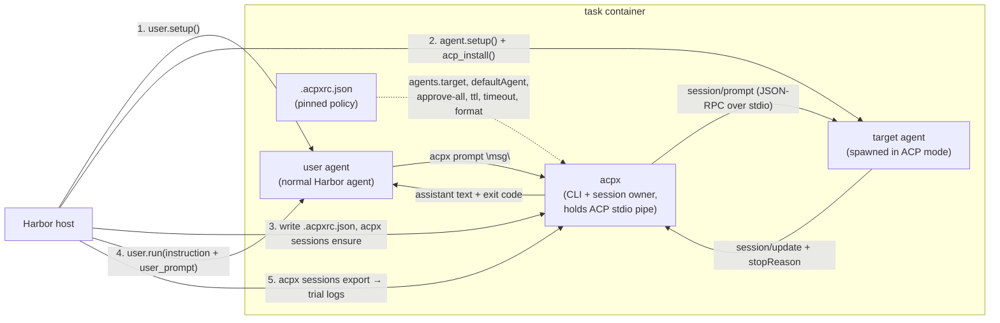
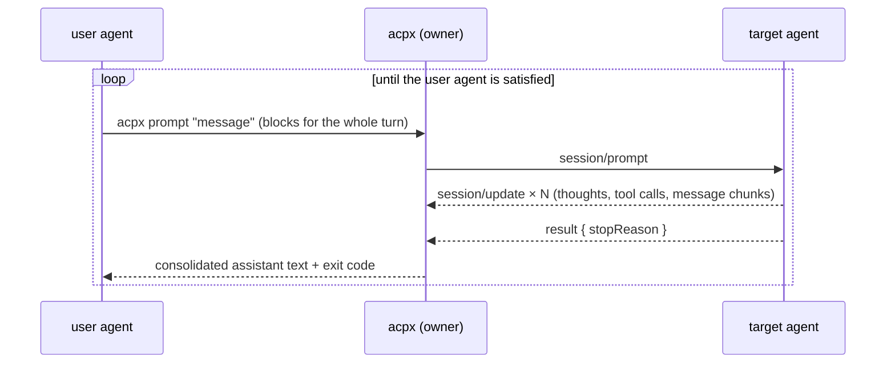

# **RFC 0002 Patch: Simulated Users with ACP**

This is a patch to RFC 0002. It narrows one layer the original left open: how the user agent talks to the target agent. The ACP client is [acpx](https://acpx.sh), flagged in review as a strong CLI replacement for a hand-rolled client ([@kobe0938](https://github.com/harbor-framework/harbor/pull/1878#issuecomment-4676988488)), and the user agent drives it through the **real acpx CLI** rather than a bespoke `chat` wrapper, following the review consensus that the client should be an existing CLI or MCP ([@alexgshaw](https://github.com/harbor-framework/harbor/pull/1878#issuecomment-4676834977)) and that forcing communication through a `chat` tool risks unnatural model behavior ([@edmcman](https://github.com/harbor-framework/harbor/pull/1878#issuecomment-4685452005)). Harbor pins all policy in a project `.acpxrc.json`, so the user agent supplies only a message; the agent command, permissions, timeouts, and output format come from config, and the session auto-resumes by cwd scope.

## Architecture



## Execution order

The phases mirror the lifecycle sketched in review ([@alexgshaw](https://github.com/harbor-framework/harbor/pull/1878#issuecomment-4676834977)):

1. **user.setup()**: install the user agent (unchanged Harbor lifecycle).
2. **agent.setup() + acp_install()**: install the target agent, then run its `acp_install()` hook (no-op for native ACP agents; installs the adapter for the rest).
3. **start ACP client**: Harbor writes `.acpxrc.json` into the workspace, registering the target under the `agents` map (`command` + `args` from `agent.acp_command()`) and pinning policy: `defaultAgent: "target"`, `defaultPermissions: "approve-all"`, `ttl: 0` (no idle shutdown), a generous `timeout`, and `format: "quiet"` (assistant text only, so the user agent sees one consolidated reply rather than the target's tool calls or thinking, per [@edmcman](https://github.com/harbor-framework/harbor/pull/1878#discussion_r3399340760)). It then runs `acpx sessions ensure`, which spawns the session owner; the owner spawns the target in ACP mode and completes `initialize` + `session/new` once, holding the stdio pipe for the whole trial.
4. **user.run(instruction + user_prompt)**: the user agent receives its prompt (the task `instruction` rendered into the user-prompt template's persona/goal and fixed acpx mechanics; Q&A 4), then runs normally and drives the entire conversation itself (the per-turn loop below). Its only new affordance is `acpx` on `PATH`; the session is keyed by `(agent, cwd)` and auto-resumes, so each `acpx prompt "msg"` continues the same conversation with no agent token, session id, or flags (the agent is resolved from the pinned `defaultAgent`). Harbor does not orchestrate turns; the phase ends when `user.run()` returns, so no explicit termination command is needed ([@edmcman](https://github.com/harbor-framework/harbor/pull/1878#discussion_r3399316133)), with existing agent timeouts as the backstop against runaway conversations.
5. **transcript + verify**: Harbor recovers the session record (turn history) via `acpx sessions export --output <trial-logs>` (cwd-default scope, no session id needed) into the trial's agent logs, then the verifier scores environment state, unchanged.

### Per-turn loop (step 4 detail)



## Q&A

**1. What is `.acpxrc.json`, how is it generated, and how do you configure it?**

It is acpx's own project-level config file (the format documented at [acpx.sh/config.html](https://acpx.sh/config.html)); acpx auto-discovers it from the working directory, so every `acpx` invocation in the trial reads the same policy. We do not hand-author or check it in. Harbor **generates it dynamically at trial setup (step 3)**, inside the container, fresh per trial, and tears it down with the container. It is a derived artifact, not a second source of truth: the human names the agent exactly once on the CLI (`--agent gemini-cli`), and Harbor translates that into the file:

```text
--agent gemini-cli  →  GeminiCli.acp_command() → ["gemini","--acp"]
                    →  .acpxrc.json { agents.target = {command:"gemini", args:["--acp"]}, defaultAgent:"target", ... }
```

So there is no double-specification; `agents.target` is computed from `--agent`, never maintained alongside it. Policy fields ship with sane defaults (`defaultPermissions: "approve-all"`, `ttl: 0`, `format: "quiet"`, a generous `timeout`). To override them, the human goes through Harbor, never the generated file: a single passthrough dict, **`acp_client_config`** (e.g. `{defaultPermissions: "deny-all", timeout: 1800}`), that Harbor merges over the defaults when writing the file. This is the minimal form of the ACP host/handler extensibility point requested in review ([@MarcoRossignoli](https://github.com/harbor-framework/harbor/pull/1878#discussion_r3402812269)). The dict maps 1:1 onto acpx's config keys, so Harbor invents no vocabulary of its own and there is no translation table to keep in sync with acpx. The only thing Harbor names is the agent, which has to map through `acp_command()` anyway. Varying policy across trials (e.g. a permission-rejection eval, [@anna239](https://github.com/harbor-framework/harbor/pull/1878#discussion_r3394013791)) is therefore a Harbor-side knob, not something the user agent controls at runtime.

**2. Why are `acp_install()` / `acp_command()` useful, given acpx already ships built-in agents that it can spin up itself?**

acpx's built-ins either assume the agent is already on `PATH` (no version control) or self-pin to acpx's own package range (acpx, not Harbor, decides the version). We deliberately do **not** use them; Harbor registers its own command as a custom `agents.target` entry, which takes precedence over any built-in. (The launch and install hooks themselves were requested in review: [@alexgshaw](https://github.com/harbor-framework/harbor/pull/1878#issuecomment-4676834977) proposed `acp_client.start(agent.acp_start_command)`, and [@MarcoRossignoli](https://github.com/harbor-framework/harbor/pull/1878#discussion_r3402771607) argued for an `acp_start()` hook so each agent class decides how to launch.) Owning the install/launch buys four things the built-ins cannot:

- **Reproducibility.** `acp_install()` pins the exact adapter version (e.g. `@zed-industries/claude-code-acp@<version>`) instead of inheriting whatever acpx resolves at the time.
- **One installation, two modes.** `acp_install()` is *additive* on top of the agent's normal `setup()`, and `acp_command()` just starts that already-installed binary in ACP mode. Leaning on acpx's built-ins would mean a second, parallel install of the same tool (Harbor's for normal trials, acpx's for ACP trials), possibly at a different version.
- **Auth consistency.** The Harbor-installed agent reads the same keys Harbor already plumbs via `--ae`, so an ACP run authenticates exactly like a normal run.
- **Coverage and stability.** acpx ships ~19 built-ins; Harbor ships more, plus internal and external (`--agent-import-path`) agents that will never be in acpx's registry. `acp_command()` decouples "speaks ACP" from "is an acpx built-in," and insulates Harbor from registry churn (gemini's ACP flag already moved from `--experimental-acp` to `--acp` once).

For native agents like gemini, `acp_command()` happens to coincide with acpx's built-in (`gemini --acp`) and `acp_install()` is a no-op. That one-line redundancy is the cost. The benefit is that acpx is demoted to a dumb executor of a command Harbor controls: the generated `.acpxrc.json` is in acpx's format, but every value in it traces back to a Harbor-owned source.

**3. Does `acpx prompt "..."` just block, and what happens to mid-turn interactions like permission requests?**

Yes, it blocks for the whole turn, like any long-running shell command; the user agent's call is suspended until the turn resolves, then receives the consolidated reply and an exit code at once. The confusion to resolve is that there are **two layers of interaction**:

- *Within one call* (target agent ↔ acpx): thinking, tool calls, and permission requests. acpx handles all of these internally while the user agent is suspended; none of them bubble up.
- *Across calls* (user agent ↔ target): the conversation messages. One `acpx prompt` is exactly one message, and the user agent only participates at these turn boundaries.

A permission request is the first kind. The ACP client that answers it is **acpx, not the user agent**. The user agent is upstream of acpx, blocked in a subprocess wait, and cannot answer mid-call. acpx resolves it from the policy pinned in `.acpxrc.json`, and only the reply content (and possibly the exit code) changes:

```text
user agent runs:  acpx prompt "do X"   ─── shell call BLOCKS ─────────────────────┐
    acpx → session/prompt → target                                                │
    target → tool_call                    acpx logs it                            │  user agent
    target → request_permission  ───────→ acpx answers per its policy             │  suspended
    target → agent_message_chunk          acpx accumulates text                   │  the whole time
    target → result {end_turn}   ───────→ acpx returns consolidated text, exit 0 ─┘
```

- `approve-all` (this patch's default): every request auto-allowed → reply + exit 0.
- `deny-all`: every tool auto-rejected; the target adapts or gives up, but the turn still completes → reply describes the limitation, exit 0.
- `approve-reads` (acpx's own default): reads auto-allowed, writes/execs fall to `nonInteractivePermissions` (`deny` → rejected, turn completes; `fail` → prompt aborts, non-zero exit). Note the stock defaults would block the target from editing files, which is why this patch pins `approve-all`.

In every case the user agent's experience has the same shape: block, then read text + exit code; it never sees a permission dialog. Making the simulated user the approver (the IDE "button-clicker" flow) is possible because ACP leaves the request pending until the client answers, but it requires a custom interactive client rather than stock acpx's headless auto-resolution, and is deferred to future work ([@anna239](https://github.com/harbor-framework/harbor/pull/1878#discussion_r3394013791), who also raised permission-rejection scenarios, ACP elicitation, and mid-prompt live interaction as future directions).

**4. How does the user agent know the acpx commands and what acpx is?**

It learns from the **injected prompt**, not from prior knowledge, and it deliberately learns exactly one command rather than all of acpx. The prompt is rendered from a Jinja2 template using Harbor's existing prompt-template mechanism (`with_prompt_template` / `render_prompt_template`); Harbor ships a default, and `--user-prompt-template-path` overrides it. The template weaves three pieces: the persona and goal (author-written), the fixed acpx mechanics (`{{ acpx_usage }}`, supplied by Harbor), and the task (`{{ instruction }}`, supplied by Harbor). The default looks like:

```jinja2
{# persona and goal: author-written, the part you customize #}
You are role-playing a user who wants this task done. Describe what you want,
react to the agent's responses, and follow up until you are satisfied.

{{ acpx_usage }}   {# Harbor-supplied mechanics: run `acpx prompt "<msg>"`; it
                      blocks and prints the reply; do not edit files yourself #}

## What you want
{{ instruction }}
```

That is all it needs. Everything else about acpx (`sessions`, `exec`, `set-mode`, flags, the agent alias) is either pinned in `.acpxrc.json` or irrelevant to a simulated user, so teaching it would only add surface to misuse and pull the model away from role-playing. The command is opaque to the model ("the way I talk to the other agent"), so it needs no concept of ACP, sessions, or even that acpx is a separate tool. Because the instruction names no alias or flags, internal changes (renaming the `agents` key, adjusting policy, even wrapping the binary) leave it untouched. Two cautions: do not rely on the model's training knowledge of acpx (it is alpha and niche, so the instruction must be self-contained, which it is); and error reactions (non-zero exit + stderr on timeout or a broken session) come for free with frontier models, so exit codes need not be taught explicitly.

This makes the injected text load-bearing for behavior, which is exactly the "tuning" concern raised in review ([@MarcoRossignoli](https://github.com/harbor-framework/harbor/pull/1878#discussion_r3394618939)). The template keeps the pieces governed differently. The **mechanics** are a Harbor-supplied variable (`{{ acpx_usage }}`), identical in every trial, so the interface wording stays a constant even when the template is overridden, just as Harbor already requires every prompt template to include `{{ instruction }}`. The **persona and goal** are the author-written part, customized per run with `--user-prompt-template-path` or left as Harbor's default template. Because the template is a run-level file independent of the task, the same user can be reused across tasks or many users swept over one task ([@johnwilmes](https://github.com/harbor-framework/harbor/pull/1878#issuecomment-4691776589)), giving the per-task persona flexibility edmcman asked for ([@edmcman](https://github.com/harbor-framework/harbor/pull/1878#discussion_r3399374390)) while the mechanics stay fixed.

**5. What extra CLI flags does this feature add?**

4 for v1:

1. `--user-agent <agent>`: the agent that plays the simulated user. (This patch renames RFC 0002's `--user`: clearer, parallels `--user-model`, and avoids the existing `harbor job share --user`.)
2. `--user-model <model>`: the model for the simulated user.
3. `--user-prompt-template-path <path>`: the Jinja2 template for the user agent's prompt. It weaves the persona/goal, the fixed acpx mechanics (`{{ acpx_usage }}`), and the task (`{{ instruction }}`); Harbor ships a default and this overrides it (Q&A 4). Reuses Harbor's existing `with_prompt_template` / `render_prompt_template`. Needed in v1 because the mechanics must reach the user agent regardless.
4. `--acp-client-config key=value` (repeatable): overrides one acpx client policy key (e.g. `defaultPermissions=deny-all`, `timeout=1800`), merged into the generated `.acpxrc.json` through the `acp_client_config` field (Q&A 1). The full dict can also be set in the job config file; the flag is the CLI shortcut for it.

Deferred to future iterations:

- `--uk` / `--ue`: per-user-agent kwargs and env, mirroring Harbor's `--ak` / `--ae`, plus external user and target agents via import paths, for advanced scenarios ([@MarcoRossignoli](https://github.com/harbor-framework/harbor/pull/1878#discussion_r3394486482)).
- Keeping the user/ACP session alive through the verifier phase, so the user agent can adapt verifier tests to the agent's implementation in SWE tasks ([@mohit-raghavendra](https://github.com/harbor-framework/harbor/pull/1878#issuecomment-4712694644)).
- Other related parameters as the feature matures.
